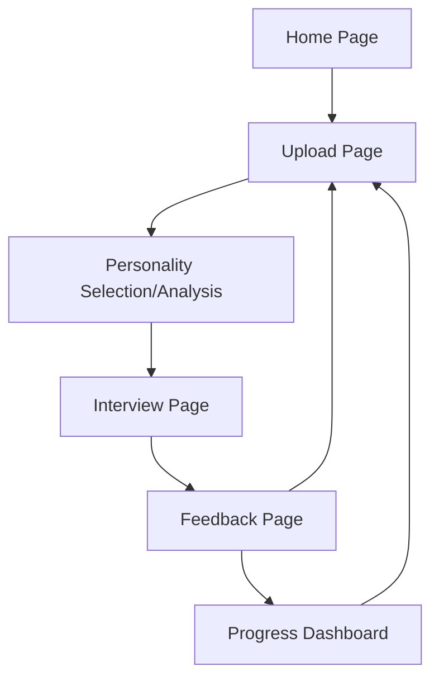

## 1. Product Overview
AI Interview Trainer is an intelligent platform that helps job seekers practice interviews with an AI-powered interviewer that adapts its **personality and difficulty** based on the context. Users upload their CV, job requirements, and company type to receive personalized mock interviews and detailed feedback.

The platform solves the problem of generic interview practice by providing a highly realistic, context-aware AI interviewer that mimics real-world interviewers—ranging from technical lead "grillers" to friendly HR managers—depending on the job and company profile.

## 2. Core Features

### 2.1 User Roles
| Role | Registration Method | Core Permissions |
|------|---------------------|------------------|
| Job Seeker | Email registration | Upload documents, start interviews, view feedback, track progress |
| Guest User | No registration | Limited trial interviews, basic feedback only |

### 2.2 Feature Module
Our AI Interview Trainer consists of the following main pages:
1. **Home page**: hero section, feature overview, get started button.
2. **Upload page**: CV upload, job specification input, company type selection.
3. **Interview page**: AI interviewer interface, personality-driven interaction, question display.
4. **Feedback page**: detailed analysis, scoring, improvement suggestions, progress tracking.

### 2.3 Page Details
| Page Name | Module Name | Feature description |
|-----------|-------------|---------------------|
| Home page | Hero section | Display product value proposition with animated graphics and call-to-action button. |
| Home page | Features showcase | Present key benefits: AI personality, real-time feedback, progress tracking. |
| Upload page | Document upload | Allow users to drag-and-drop or browse CV files (PDF/DOCX), with file validation. |
| Upload page | Job specification | Text input field for job requirements, responsibilities, and qualifications. |
| Upload page | Company type selector | Dropdown menu to select company size, industry, and culture type. |
| Upload page | Start interview | Generate personalized interview questions and **interviewer personality**. |
| Interview page | AI interviewer | Display AI-generated questions with a specific persona (e.g., "The Tough Technical Lead", "The Cultural Fit Enthusiast"). |
| Interview page | Response input | Text input field and voice recording button for user responses. |
| Interview page | Interview controls | Pause, restart, and end interview buttons with session timer. |
| Feedback page | Performance score | Display overall score with breakdown by categories (communication, technical, cultural fit). |
| Feedback page | Detailed analysis | Show question-by-question feedback with strengths and areas for improvement. |
| Feedback page | Improvement suggestions | Provide specific recommendations and resources for skill development. |
| Feedback page | Progress tracking | Visual charts showing improvement over multiple interview sessions. |

## 3. Core Process
**User Flow:**
1. User lands on Home page and clicks "Start Interview Training"
2. User uploads CV, enters job specifications, and selects company type
3. System analyzes context to determine the **Interviewer Personality** (e.g., a "Strict Startup CTO" for a Senior Dev role at a Fintech startup)
4. System generates personalized interview questions using AI
5. User begins interview session with AI interviewer mimicking the chosen persona
6. User responds to questions via text or voice input
7. AI analyzes responses in real-time and asks follow-up questions, maintaining persona
8. Interview concludes and detailed feedback is generated
9. User reviews feedback, scores, and improvement suggestions

## 4. User Interface Design

### 4.1 Design Style
- **Framework**: Next.js with Tailwind CSS
- **Component Library**: shadcn/ui (Radix UI)
- **Primary Colors**: Professional blue (#2563EB) and white (#FFFFFF)
- **Secondary Colors**: Success green (#10B981) and warning orange (#F59E0B)
- **Button Style**: shadcn/ui default (rounded-md), subtle shadows, hover animations
- **Typography**: Inter font family, 16px base size, clear hierarchy
- **Layout**: Card-based design with generous white space, responsive grid system
- **Icons**: Modern line icons from Lucide React library

### 4.2 Page Design Overview
| Page Name | Module Name | UI Elements |
|-----------|-------------|-------------|
| Home page | Hero section | Full-width gradient background, shadcn/ui Hero component, prominent CTA button. |
| Upload page | Document upload | shadcn/ui Card with drag-and-drop zone, file type icons, upload progress indicator. |
| Interview page | Chat interface | Message bubbles with AI persona avatar, typing indicator, shadcn/ui input field with voice button. |
| Feedback page | Score display | shadcn/ui Tabs for breakdown, progress charts, detailed feedback cards. |

### 4.3 Responsiveness
Desktop-first design approach with full mobile adaptation using Tailwind CSS. Touch-optimized interactions for mobile devices, including shadcn/ui responsive components.

### 4.4 3D Scene Guidance
Not applicable for this project - focused on clean, professional interface design.
