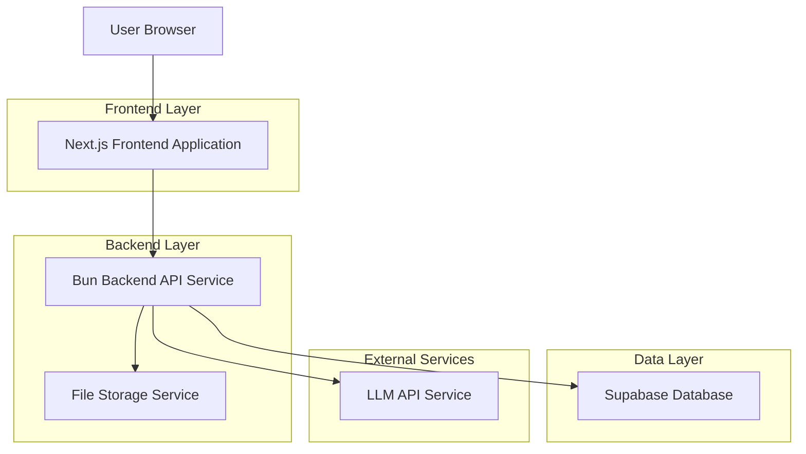
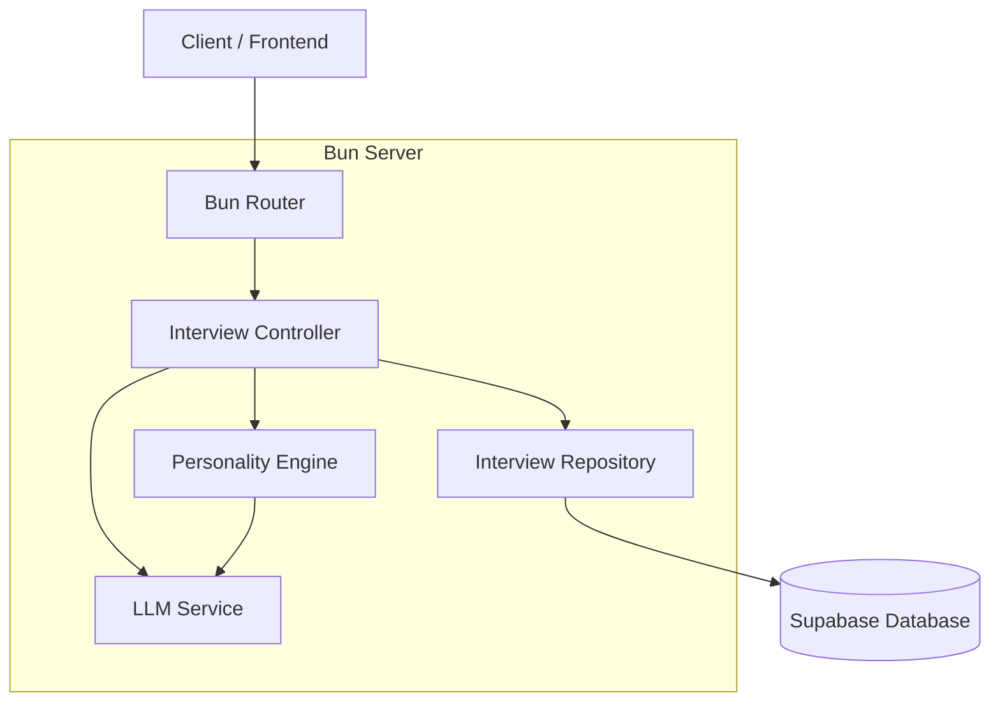
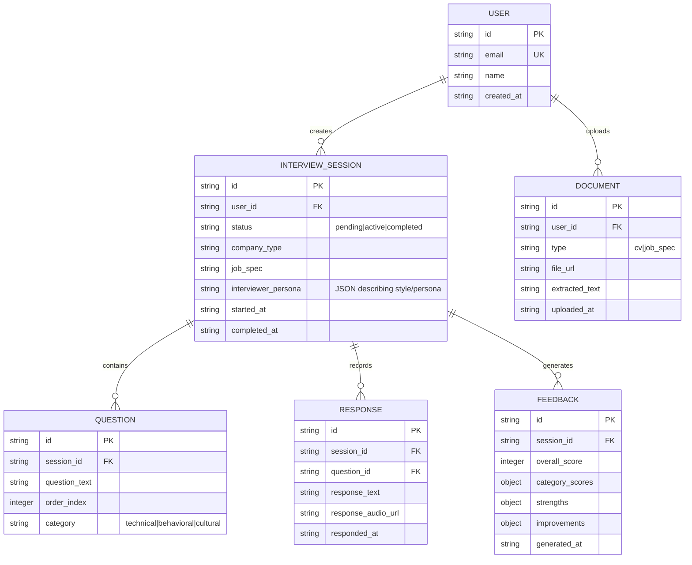

## 1. Architecture design



## 2. Technology Description

* Frontend: Next.js 14+ (App Router), Tailwind CSS, shadcn/ui

* Backend: Bun (TypeScript)

* Database: Supabase (PostgreSQL)

* File Storage: Supabase Storage

* LLM Integration: OpenAI GPT-4o API (for personality and question generation)

* State Management: Zustand (Frontend)

## 3. Route definitions

| Route            | Purpose                                                            |
| ---------------- | ------------------------------------------------------------------ |
| /                | Home page, landing with hero section and features                  |
| /upload          | Upload page for CV, job specs, and company type                    |
| /interview/\[id] | Interview session page with AI chat interface and specific persona |
| /feedback/\[id]  | Feedback page showing detailed analysis and scores                 |
| /dashboard       | User dashboard for progress tracking and history                   |
| /login           | User authentication page                                           |
| /register        | New user registration page                                         |

## 4. API definitions

### 4.1 Core API

**Start Interview Session**

```
POST /api/interview/start
```

Request:

| Param Name    | Param Type | isRequired | Description                         |
| ------------- | ---------- | ---------- | ----------------------------------- |
| cv\_text      | string     | true       | Extracted text from uploaded CV     |
| job\_spec     | string     | true       | Job requirements and specifications |
| company\_type | object     | true       | { size, industry, culture }         |
| user\_id      | string     | true       | User identifier from authentication |

Response:

| Param Name           | Param Type | Description                               |
| -------------------- | ---------- | ----------------------------------------- |
| session\_id          | string     | Unique interview session identifier       |
| interviewer\_persona | object     | { name, description, style, avatar\_url } |
| first\_question      | string     | Initial AI-generated question in persona  |
| status               | string     | Session status (started)                  |

**Process Interview Response**

```
POST /api/interview/respond
```

Request:

| Param Name   | Param Type | isRequired | Description                   |
| ------------ | ---------- | ---------- | ----------------------------- |
| session\_id  | string     | true       | Interview session identifier  |
| response     | string     | true       | User's answer to the question |
| question\_id | string     | true       | Current question identifier   |

Response:

| Param Name     | Param Type | Description                           |
| -------------- | ---------- | ------------------------------------- |
| next\_question | string     | Follow-up question from AI in persona |
| analysis       | object     | Real-time analysis of response        |
| is\_complete   | boolean    | Whether interview should end          |

**Generate Feedback**

```
POST /api/interview/feedback
```

Request:

| Param Name  | Param Type | isRequired | Description                    |
| ----------- | ---------- | ---------- | ------------------------------ |
| session\_id | string     | true       | Completed interview session ID |

Response:

| Param Name     | Param Type | Description                         |
| -------------- | ---------- | ----------------------------------- |
| overall\_score | number     | Total score out of 100              |
| breakdown      | object     | Category-wise scores and analysis   |
| suggestions    | array      | List of improvement recommendations |
| strengths      | array      | Identified strong points            |

## 5. Server architecture diagram



## 6. Data model

### 6.1 Data model definition



### 6.2 Data Definition Language (Postgres)

**Interview Sessions Table (interview\_sessions)**

```sql
CREATE TABLE interview_sessions (
    id UUID PRIMARY KEY DEFAULT gen_random_uuid(),
    user_id UUID NOT NULL REFERENCES users(id),
    status VARCHAR(20) NOT NULL DEFAULT 'pending' CHECK (status IN ('pending', 'active', 'completed')),
    company_type JSONB NOT NULL,
    job_spec TEXT NOT NULL,
    interviewer_persona JSONB NOT NULL, -- New field for personality
    started_at TIMESTAMP WITH TIME ZONE,
    completed_at TIMESTAMP WITH TIME ZONE,
    created_at TIMESTAMP WITH TIME ZONE DEFAULT NOW()
);
```

*(Other tables remain similar but updated to support Bun/TypeScript types)*
